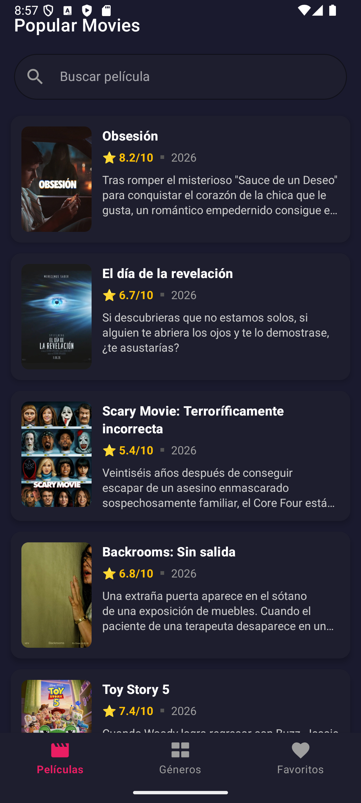
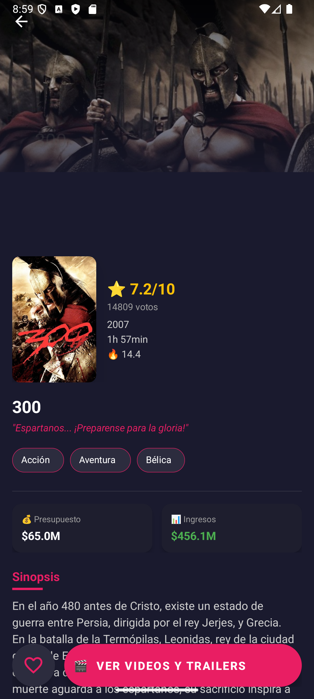
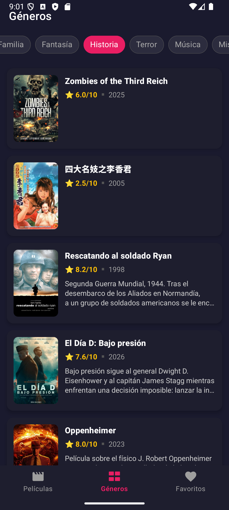
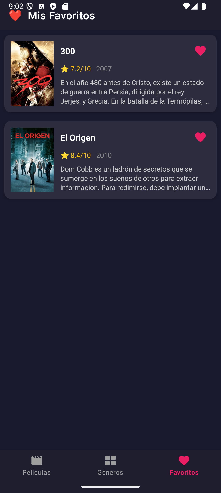

# MovieDB 🎬

Aplicación Android para explorar películas usando la API de [The Movie Database (TMDB)](https://www.themoviedb.org/). Desarrollada como proyecto de portfolio con enfoque en arquitectura limpia y buenas prácticas de la industria.

---

## Capturas de pantalla

| Películas populares | Detalle de película | Géneros |
|:---:|:---:|:---:|
|  |  |  |

| Favoritos | Videos y Trailers |
|:---:|:---:|
|  |  |

---

## Stack tecnológico

| Categoría | Tecnología |
|---|---|
| Lenguaje | Kotlin |
| Arquitectura | Clean Architecture + MVVM |
| DI | Hilt |
| Red | Retrofit + OkHttp + Gson |
| Persistencia | Room |
| Paginación | Paging 3 |
| Imágenes | Glide |
| Navegación | Navigation Component (Single Activity) |
| Async | Coroutines + StateFlow |
| UI | ViewBinding + Material Design 3 |

---

## Arquitectura

El proyecto sigue **Clean Architecture** organizada por features:

```
com.alexvicente.moviedb
├── core/                      # Código compartido entre features
│   ├── data/
│   │   ├── local/             # Room: DAOs, Entities, Database
│   │   ├── mapper/            # Entity → Domain mappers
│   │   └── network/           # Retrofit, OkHttp, Interceptors
│   ├── di/                    # Módulos Hilt compartidos
│   ├── domain/model/          # Modelos de dominio
│   └── util/                  # Constants, Extensions, AppError
│
└── features/
    ├── favorites/             # Favoritos (100% local, sin API)
    ├── genres/                # Géneros + películas por género (Paging 3)
    ├── movie_details/         # Detalle de película
    ├── popular_movies/        # Películas populares
    ├── search/                # Búsqueda con debounce
    └── videos/                # Videos/trailers de películas
```

Cada feature sigue la estructura:
```
feature/
├── data/          # DTOs, API, RepositoryImpl
├── di/            # Módulo Hilt del feature
├── domain/        # Modelos, Repository interface, UseCases
└── presentation/  # ViewModel, Fragment, Adapter, UiState
```

---

## Features

- **Películas populares** — listado paginado con caché offline (Room)
- **Géneros** — lista de géneros con filtrado de películas por género (Paging 3)
- **Detalle de película** — información completa con rating, presupuesto, ingresos y géneros
- **Videos/Trailers** — reproducción de trailers vía app de YouTube o navegador web
- **Búsqueda** — búsqueda en tiempo real con debounce de 500ms
- **Favoritos** — agregar/eliminar favoritos almacenados localmente con Room

---

## Configuración del proyecto

### Requisitos

- Android Studio Hedgehog o superior
- JDK 21 (JBR recomendado — configurar en **Settings → Build → Gradle → Gradle JDK**)
- API key de TMDB (Bearer Token de lectura)
- minSdk 24 / targetSdk 36

### Configuración de la API key

1. Crear una cuenta en [themoviedb.org](https://www.themoviedb.org/) y obtener un **Bearer Token** de lectura
2. En la raíz del proyecto, agregar al archivo `local.properties`:

```properties
TMDB_TOKEN=tu_bearer_token_aqui
```

3. Sincronizar Gradle — el token se inyecta automáticamente via `BuildConfig.TMDB_TOKEN`

> ⚠️ `local.properties` está en `.gitignore` y nunca debe subirse al repositorio.

### Clonar y ejecutar

```bash
git clone https://github.com/Alex-Vicente11/AppTest.git
cd AppTest
# Agregar TMDB_TOKEN a local.properties
# Abrir en Android Studio y ejecutar
```

---

## Tests

El proyecto cuenta con tres niveles de testing:

| Tipo | Herramientas | Cobertura |
|---|---|---|
| Unit tests | JUnit, MockK, Truth, Turbine | ~20% |
| Unit tests con contexto Android | Robolectric | Incluido |
| Instrumentados | Espresso, Hilt Testing, MockK Android | Fragmentos principales |

### Ejecutar tests

```bash
# Unit tests
./gradlew test

# Reporte de cobertura JaCoCo
./gradlew jacocoTestReport
# Reporte en: build/reports/jacoco/html/index.html

# Tests instrumentados (requiere emulador o dispositivo)
./gradlew connectedAndroidTest
```

---

## Decisiones técnicas destacadas

**Paging 3 con caché offline** — Las películas populares usan Room como _single source of truth_. La red solo se consulta cuando la caché está vacía o expirada.

**Manejo de errores centralizado** — `AppError` + `ErrorMapper` + `Resource<T>` proveen un sistema unificado de manejo de errores en todas las capas.

**Single Activity** — Toda la navegación ocurre dentro de `MainActivity` mediante Navigation Component.

**Favoritos sin API** — El módulo de favoritos es 100% local — Room es la única fuente de datos, sin Retrofit ni DTOs.

---

## CI/CD Pipeline

Este proyecto cuenta con un pipeline de integración continua implementado con **Jenkins** y **Docker**, siguiendo un enfoque de Infrastructure as Code, migrado a **Multibranch Pipeline** para descubrir automáticamente ramas y Pull Requests sin configuración manual por rama.

### Infraestructura

- **`ci/Dockerfile`**: define un agente Jenkins personalizado (basado en `jenkins/jenkins:lts`) con Android SDK, build-tools y platforms preinstalados, garantizando builds reproducibles sin configuración manual.
- **`Jenkinsfile`**: define el pipeline como código, con las siguientes etapas:
  1. **Checkout** — usa `checkout scm`, delegando en la configuración del Multibranch Pipeline para clonar la rama o Pull Request correcto en cada contexto (vía SSH, con Deploy Key de solo lectura)
  2. **Prepare SDK** — genera `local.properties` dinámicamente
  3. **Lint** — análisis estático de código
  4. **Unit Tests** — ejecuta la suite completa de tests unitarios
  5. **Build APK** — genera el artefacto `.apk` de debug (solo en `main` y en Pull Requests, ver detalle abajo)

### Multibranch Pipeline

El job escanea el repositorio completo y crea automáticamente un sub-job por cada rama que contenga un `Jenkinsfile`, además de detectar Pull Requests como jobs independientes.

- **Discover branches**: descubre ramas automáticamente, excluyendo aquellas que ya están cubiertas por un Pull Request abierto (evita builds duplicados)
- **Discover pull requests from origin**: descubre PRs y ejecuta el build sobre un **merge simulado** con la rama destino (estrategia *"Merging the pull request with the current target branch revision"*), validando cómo quedaría el código ya integrado, no solo la rama aislada
- **Checkout over SSH**: fuerza que el clonado use la Deploy Key SSH dedicada, separado de las credenciales usadas para el descubrimiento vía API de GitHub
- **Scan periódico**: re-escaneo cada 1 hora como respaldo del webhook
- **Orphaned Item Strategy**: sub-jobs de ramas eliminadas se descartan automáticamente tras 7 días

### Build condicional por contexto

El stage `Build APK` solo se ejecuta en `main` o cuando el build corresponde a un Pull Request (`changeRequest()`), evitando generar artefactos innecesarios en ramas de feature sueltas sin PR abierto:

```groovy
stage('Build APK') {
    when {
        anyOf {
            branch 'main'
            changeRequest()
        }
    }
    steps {
        sh './gradlew assembleDebug'
    }
}
```

Lint y Unit Tests corren siempre, en cualquier rama o PR, dando señal temprana de errores sin esperar a un merge.

### Automatización

El pipeline se dispara automáticamente en cada `push` a cualquier rama y en cada evento de Pull Request (`opened`, `synchronize`, etc.) mediante un **webhook de GitHub**, sin intervención manual.

### Branch Protection

La rama `main` está protegida mediante un **Ruleset** de GitHub:

- Requiere Pull Request antes de mergear (no se permite push directo a `main`)
- Requiere que el check `continuous-integration/jenkins/pr-merge` pase exitosamente
- Requiere que la rama esté actualizada con `main` antes de mergear
- Bloquea force pushes y restringe la eliminación de la rama

Este flujo fue validado de punta a punta: se forzó intencionalmente el fallo de un test (`assertThat(movies).hasSize(5)` → `hasSize(4)`) para confirmar que GitHub bloquea el botón de merge mientras el check requerido esté en rojo, y que se desbloquea automáticamente al corregir el test y que el build vuelva a pasar.

### Seguridad

- Autenticación vía SSH con una **Deploy Key dedicada de solo lectura** (`git`), independiente de las credenciales personales del desarrollador y separada del token usado para el descubrimiento de ramas/PRs vía API
- Autenticación vía **Personal Access Token (fine-grained)** para el descubrimiento de ramas/PRs y el reporte de status checks a GitHub, con permisos mínimos necesarios (Contents: read, Pull requests: read, Commit statuses: read/write)
- Credenciales gestionadas mediante el sistema de Credentials de Jenkins (nunca expuestas en texto plano)

### Reproducibilidad

Se validó que el `.apk` generado por el pipeline es **binariamente idéntico** (0 bytes de diferencia por archivo) al generado localmente, confirmando la consistencia del entorno de build.

---

## CI/CD con GitHub Actions

Como ejercicio comparativo, el mismo pipeline se replicó en **GitHub Actions**, usando el CI nativo de la plataforma en vez de un servidor propio.

### Estructura

A diferencia de Jenkins (un único `Jenkinsfile` con lógica condicional según el contexto), el pipeline de Actions se dividió en **dos workflows independientes**, cada uno con una única responsabilidad:

- **`.github/workflows/android-ci-pr.yml`** — trigger `pull_request` hacia `main`. Corre Checkout, Prepare SDK, Lint, Unit Tests y Build APK siempre (al estar acotado al contexto de PR, no necesita condicional). Es el check que protege `main`.
- **`.github/workflows/android-ci-branch.yml`** — trigger `push` a cualquier rama. Mismas etapas, pero `Build APK` condicionado a `github.ref == 'refs/heads/main'`, evitando generar artefactos en ramas de feature sueltas. Es informativo, no bloquea merges.

Separar en dos archivos (en vez de un único workflow con ambos triggers, como se intentó inicialmente) resolvió además un problema real de builds duplicados: un mismo push a una rama con PR abierto disparaba el workflow dos veces (`push` y `pull_request`) por el mismo cambio.

### Equivalencias con Jenkins

| Jenkins | GitHub Actions | Nota |
|---|---|---|
| `agent any` + `ci/Dockerfile` | `runs-on: ubuntu-latest` | Actions ya trae Android SDK preinstalado; Jenkins requirió construir una imagen propia |
| `checkout scm` | `actions/checkout@v4` | Equivalente directo |
| Credencial `tmdb-token` (Secret text) | `${{ secrets.TMDB_TOKEN }}` | Mismo propósito, gestionado como GitHub Secret en vez de credencial de Jenkins |
| `when { anyOf { branch 'main'; changeRequest() } }` | `if: github.ref == 'refs/heads/main'` (en el workflow de branch) | En Actions, el equivalente al contexto de PR ya está separado en su propio workflow, sin necesitar el condicional |
| Multibranch Pipeline + Behaviours (discovery de ramas/PRs) | No aplica — cualquier push o PR con el archivo en `.github/workflows/` dispara el workflow automáticamente | Actions no requiere configurar discovery |
| `archiveArtifacts` | `actions/upload-artifact@v4` | Equivalente directo |
| Webhook de GitHub configurado manualmente | Integración nativa | Sin webhooks que mantener ni scans manuales de respaldo |

### Branch Protection con Ruleset (Jenkins + Actions)

La rama `main` está protegida por el mismo Ruleset descrito en la sección de Jenkins, con ambos sistemas de CI reportando estado:

- **GitHub Actions — required.** El check requerido en el Ruleset se llama `build`, que corresponde al **nombre del job** dentro del YAML (`jobs: build:`), no al nombre visible compuesto que muestra la interfaz (`Android CI Branch / build (push)`). Este fue el hallazgo clave de un troubleshooting extenso: GitHub hace el matching contra el identificador del job, no contra el string completo mostrado en la UI. Como consecuencia, **ambos workflows** (`android-ci-pr.yml` y `android-ci-branch.yml`) — al compartir el mismo nombre de job `build` — quedan cubiertos por la misma regla `Required`.
- **Jenkins (`continuous-integration/jenkins/pr-merge`) — informativo.** Sigue corriendo y reportando en cada PR (vía Commit Status API), pero no bloquea el merge. Se mantiene como pipeline de referencia para practicar administración de infraestructura propia (agentes Docker, credenciales, Multibranch Discovery).

Este flujo fue validado de punta a punta con el mismo método que Jenkins: se rompió intencionalmente un test para confirmar que GitHub bloqueaba el merge mientras el check requerido estuviera en rojo, y se confirmó el desbloqueo automático al corregirlo.

### Seguridad

- `TMDB_TOKEN` gestionado como **GitHub Secret** a nivel de repositorio, inyectado en `local.properties` únicamente durante el step `Prepare SDK`
- GitHub Actions enmascara automáticamente el valor del secret en los logs, igual que Jenkins con `withCredentials`

### Panorama: ¿por qué elegir Jenkins o GitHub Actions?

La elección real en la industria depende menos del tamaño de la empresa y más de estos factores:

- **Dónde vive el código** — el CI nativo de la plataforma (Actions para GitHub, GitLab CI para GitLab) suele ganar por defecto si no hay una razón para pelear contra esa integración.
- **Quién es dueño de la infraestructura** — sectores regulados (banca, salud, gobierno) suelen requerir CI **self-hosted** por compliance, favoreciendo Jenkins u otras soluciones on-premise, independientemente del tamaño de la empresa.
- **Complejidad heredada del pipeline** — Jenkins y su ecosistema de plugins siguen siendo dominantes en organizaciones con pipelines viejos, heterogéneos o muy específicos de negocio.
- **Tamaño del equipo de plataforma** — equipos pequeños sin presupuesto para mantener infraestructura propia suelen preferir soluciones SaaS como Actions, sin servidores que administrar.

Otras herramientas equivalentes: GitLab CI/CD, CircleCI, Azure DevOps Pipelines, AWS CodePipeline/CodeBuild, TeamCity, Bamboo (CI); ArgoCD/Flux (CD vía GitOps, complementarias a un CI, no sustitutas).

---

## Deuda técnica conocida

- Cobertura de tests: ~20% (objetivo: 60% en v1.1)
- Tests instrumentados pendientes: `MovieDetailsFragment`, `SearchFragment`, `VideosFragment`
- `fallbackToDestructiveMigration` activo — se eliminará cuando se implementen migraciones de Room
- `TMDB_TOKEN` queda embebido en el `.apk` compilado (limitación inherente de `BuildConfig`), aceptable en este contexto por tratarse de un token de solo lectura sobre una API pública. En un entorno de producción real, se recomendaría proxear las llamadas a través de un backend propio o una función serverless intermedia.

---

## Licencia

Este proyecto es de uso educativo y portfolio personal.
